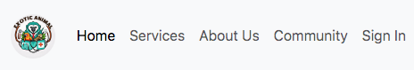
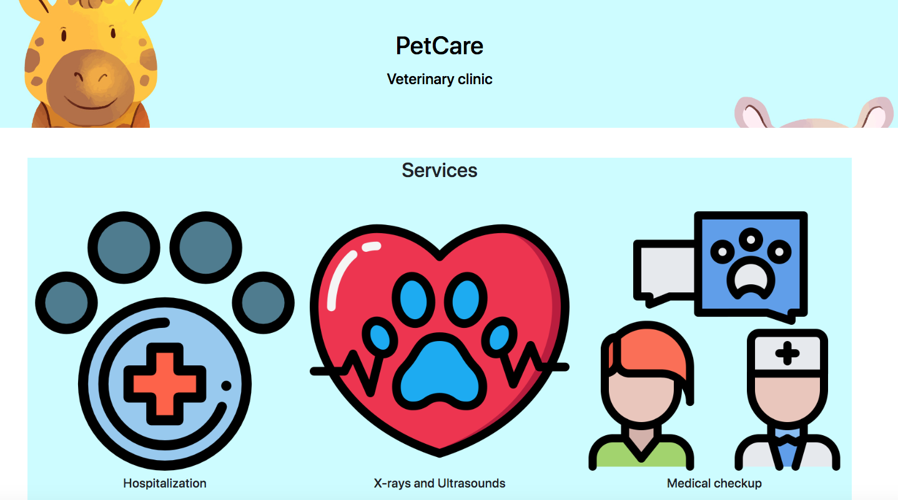
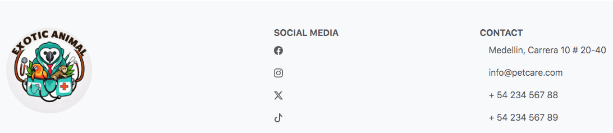
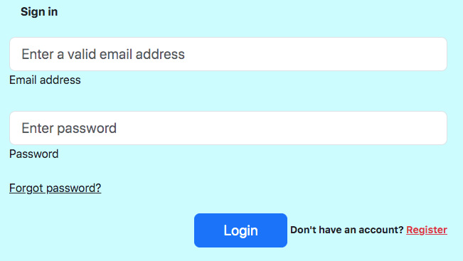
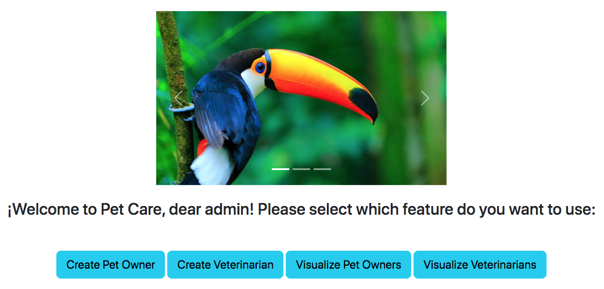
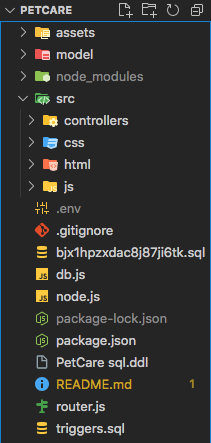

# PetCare

Pet Health and Appointment Management System. This project has 3 roles: clinic administrator, pet owner and veterinarian. Each role has its own features. Additionally, it has 3 modules: manage pets, schedule appointments and medicines and recipes.

This is the result of the final project of the subject "Software construction project" of the university of Politecnico Colombiano Jaime Isaza Cadavid, from Medellin.

## Table of contents

- Demo
- Features
- Intallation Step
- The process
  - Built with
  - Structure
- Useful resources
- License
- Authors

## Demo

## Features

The clinic administrator is able to:

- manage users
- check medicine stock
- manage appointments

The veterinarian is able to:

- visualize scheduled appointments
- manage medical history of pets
- generate new treatments

The pet owner is able to:

- visualize medical history
- register a pet
- schedule an appointment

## Installation steps

1. clone the repository
2. open the project with your favorite IDE
3. type "npm start" in the CLI, to start the server
4. open the website <http://localhost:3007/home> in your browser
5. enjoy the app

## The process

### Build with

Languages:

- JavaScript
- HTML
- CSS

Frameworks:

- Bootstrap
- Express

Others:

- Node.js

DBMS:

- MySQL

Metodology:

- Agile (SCRUM)

Main modules:

- router
- path
- sweetalert2
- mysql2
- bcrypt
- cors

### Structure

## Useful resources

- [Figma](https://www.figma.com/files/team/1408666051855170706/recents-and-sharing?fuid=1232352955593394028) - Used to create graphics
- [Cloudinary](https://cloudinary.com) - SaaS cloud

## License

Without license

## Authors

- Manuela Diaz Arboleda
- Maria Jose Arcila
- David Correa Posada
